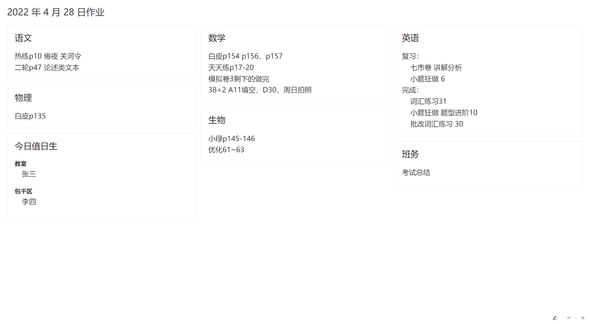

# ClassTools

<!-- 这个 all contributors 的 badge 非要换行，因为有那个注释 -->
<!-- ALL-CONTRIBUTORS-BADGE:START - Do not remove or modify this section -->

<!-- ALL-CONTRIBUTORS-BADGE:END -->

这是一个用在班级电脑上面的教室系统🎉，以动态壁纸方式呈现高考倒计时、作业、课程表、值日生等看板，并提供简单易用的设置界面。

本项目使用 [Electron](https://www.electronjs.org/) [Vue3](https://vuejs.org/) [NaiveUI](https://www.naiveui.com) 等工具构建。[在线体验](https://demo.ct.0w.al/#/)

[2.0版本](https://github.com/luoling8192/ClassTools)

## 实现功能

- [x] 时钟显示
- [x] 高考倒计时
- [x] 实时天气
- [x] 作业布置
- [x] 独立作业看板
- [x] 标语展示
- [x] 值日生设置
- [x] 课程表展示

## 截图展示

## 开源协议

本项目使用 GPLv3 开源许可证开源。
